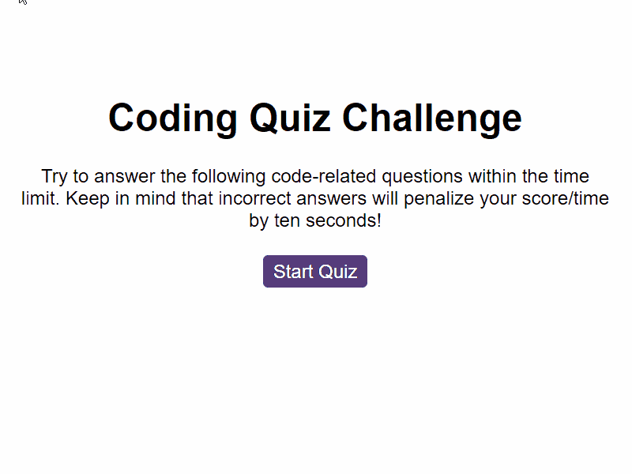

# Code Quiz Challenge

## Description
This web application is a timed coding quiz with multiple-choice questions designed to help coding boot camp students assess their understanding of JavaScript fundamentals. The app features a clean and responsive user interface, with dynamically updated HTML and CSS powered by JavaScript code. The quiz starts when the user clicks the "Start" button, and a timer begins. Users are presented with questions, and their scores are calculated based on correct answers and the time taken to complete the quiz.

## Table of Contents

  - [Description](#description)
  - [Installation](#installation)
  - [Usage](#usage)
  - [Features](#features)
  - [Screenshot and links](#screenshot-and-links)
  - [Credits](#credits)
  - [Technologies Used](#technologies-used)

## Installation

To run this project locally, follow these steps:

1. Download the starter code from Code Quiz Code and unzip the zip file.

2. Open the index.html file in your preferred web browser.

3. Start the quiz by clicking the "Start" button.

&nbsp;&nbsp;&nbsp;&nbsp;&nbsp;&nbsp;You can clone the repository to your local machine! In Bash type:

&nbsp;&nbsp;&nbsp;&nbsp;&nbsp;&nbsp;`git clone https://github.com/MrKatrish/code_quiz`

## Usage

1. Click the "Start" button to begin the quiz.

2. Answer each question by selecting the correct option.

3. If an incorrect answer is chosen, time is subtracted from the clock.

4. The game ends when all questions are answered or the timer reaches 0.

5. After the game is over, you can save your initials and view your score.

## Features

- **Timed Quiz:** The app initiates a timer when the user starts the quiz, deducting time for incorrect answers.

- **Multiple-Choice Questions:** Users encounter a series of multiple-choice questions covering JavaScript fundamentals.

- **Correct and Incorrect Answer Sounds:** Upon selecting a correct answer, a pleasant and affirmative sound is played. In the case of an incorrect answer, a distinctive and attention-grabbing sound is triggered.

- **Solution Display after Answer:** Following the user's selection, a line of text appears, indicating whether the chosen answer was correct or incorrect.

- **Score Saving:** Upon completing the quiz, users can save their initials and access their scores.

## Screenshot and links

### Link to my application

https://mrkatrish.github.io/code_quiz/

## Credits

Special thanks to everyone who contributed to the development of this project:

- The instructor and teaching assistant from edX School for their support, valuable insights, and dedicated tutoring.
- The edX community for providing an inspiring learning environment and educational resources.
- The [Mozilla Developer Network](https://developer.mozilla.org/en-US/) and [W3Schools](https://www.w3schools.com/) for excellent documentation and assistance in understanding web technologies.
- My amazing group mates for collaboration, idea exchange, and creating a positive atmosphere.

Thanks for your dedication and support!

## Technologies Used
- HTML5
- CSS3
- JavaScript